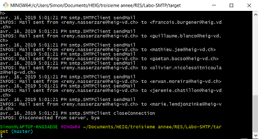

# Labo-SMTP

## Description du programme

Ce programme a pour but de forger des mails puis de les envoyer à un certain nombre de personnes, choisies aléatoirement. Ces dernières auront alors l'illusion de recevoir un mail d'une personne. Pour ne pas congestionner inutilement un vrai service mail, nous utiliserons un "simulateur" de boîte mail, connu sous le nom de *serveur mock*. Nous verrons par la suite comment configurer un tel serveur.

Le programme automatise l'envoi d'un certain nombre de mail, depuis un émetteur aléatoire vers plusieurs récepteurs aléatoires. Le programme partitionne la liste des victimes en un nombre de groupe spécifié puis choisit un émetteur et un message au hasard pour chaque groupe.

## configuration

Après avoir cloné le projet, aller dans le dossier /config contenu à la racine pour changer les données de configuration

* **configs.utf8** contient les données du serveur (adresse et port) ainsi que le nombre de groupe à former et l'adresse à laquelle envoyer en copie.

* **messages.utf8** contient la liste de faux mails (attention, ne pas oublier de rajouter le délimiteur *==* pour chque nouveau message)

* **victims.txt** contient la liste des adresses mail des victimes

### Configuration du serveur mock

Un fichier DockerFile est présent à la racine du projet et permet d'importer automatiquement tous les fichiers nécesaires à partir du projet git se trouvant à l'adresse [lien MockMock](https://github.com/tweakers/MockMock) pour créer une image et lancer un container. Se placer à la racine (où se trouve le DockerFile) puis taper la commande suivante pour créer l'image :

```bash
docker build -t <nom_image> .
```

Docker va ensuite télécharger toutes les dépendances nécessaires. Cette opération risque de prendre un certain temps. Taper ensuite la commande suivante pour lancer le container :

```bash
docker run -it -p 2525:2525 -p 8282:8282 smtp -p 2525 -h 8282
```

Le *2525:2525* est nécessaire car c'est le point d'entrée du serveur dans le container et le *8282:8282* sert à accéder à l'interface web du MockMock.

### Lancement du client

Une fois le serveur lancé, il faut construire et exécuter le programme *MailRobot*. Pour ce faire, se placer à la racine et taper la commandes

```bash
mvn clean install
```

Ceci va construire le projet Maven et générer un exécutable (*.jar*) dans le dossier /target.
Aller donc dans ce dossier puis Taper

```bash
java -jar Labo-SMTP-1.0-SNAPSHOT.jar
```

Par défaut, l'adresse contenue dans le fichier de configuration est l'adresse de base de la machine docker, il est possible de la remplacer par *localhost* si on ne désire pas lancer le serveur Mock dans un container docker.

Si tout s'est dérouler normalement, le programme devrait avoir envoyé les mails de manière aléatoire et le résultat en console devrait être de la forme:



Il est également possible de visualiser la liste de mails directement via l'interface web :


